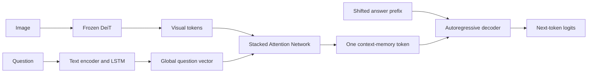
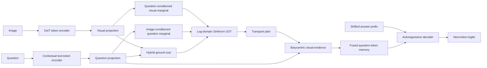
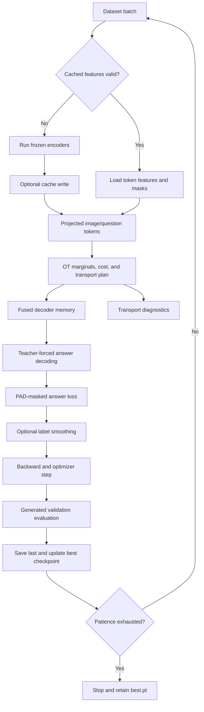

# Question-Conditioned Optimal Transport Fusion Implementation Plan

## Implementation status

The engineering work in milestones M1 through M6.1 is implemented in the main pipeline:
token feature extraction and validated caches, Balanced OT and UOT, learned marginals,
hybrid costs, barycentric fusion, decoder memory masks, diagnostics, version-3
checkpoints, generated-answer validation, exact training-state resume, Apple MPS execution,
early stopping, label smoothing, compact-decoder controls, frozen answer embeddings, and
image/question reliance diagnostics. SAN remains the default and version-2 SAN
checkpoints remain supported.

Milestones M0 and M7 are experiment procedures. They still require running the recorded
SAN baseline and controlled multi-seed comparisons on the target hardware and datasets;
the implementation does not claim an accuracy improvement before those measurements.

## 1. Purpose and scope

This document is the implementation roadmap for adding real Optimal Transport (OT)
alignment and fusion to the main VQA training and inference pipeline. It translates the
Question-Conditioned Unbalanced Optimal Transport (UOT) proposal in
`docs/secret_docs/DCNC_HoVoHoangDuy2.pdf` into ordered engineering work with explicit
interfaces, tensor shapes, tests, experiment controls, and completion criteria.

The codebase supports English text processing and English text encoders only. The
default is `bert-base-uncased`; an explicitly configured PhoBERT/VinAI or Vietnamese
encoder name fails immediately with a clear error. There is no language-selection CLI
option, Vietnamese segmenter dependency, language-specific dataset class, or language
field in new checkpoints. Training, validation, cached feature generation, and prediction
share whitespace-only normalization and the English tokenizer recorded in the checkpoint.
The dataset loader is `utils/vqa_dataset.py` and is independent of language. Checkpoint
loading migrates legacy English model-state keys to the current generic encoder names;
this preserves compatible English checkpoints without retaining the old language-specific
code path.

The first implementation covers image-question alignment and transport-plan feature
fusion. It does **not** implement adaptive retrieval, RAG, evidence selection, teacher
models, student models, or knowledge distillation. Those components depend on a stable,
measured OT fusion layer and remain future work.

The initial engineering dataset is the included English GQA subset:

| Split | Examples | Purpose |
| --- | ---: | --- |
| Train | 1,000 | Training and small-scale overfitting checks |
| Validation | 100 | Model selection and ablation comparison |
| Test | 100 | Final held-out comparison after choices are locked |

This subset validates correctness and integration. It is too small to support broad
research claims about VQA accuracy.

### 1.1 Measured bottleneck found after the first UOT run

The first 50-epoch-budget GQA UOT experiment successfully exercised the full pipeline, but it
did not establish a generalization improvement. The stored history and a 32-example
counterfactual diagnostic show three separate bottlenecks:

| Signal | Measured result | Interpretation |
| --- | ---: | --- |
| Best generated validation F1 | `0.29` at epoch 9 | Use `best.pt`; later epochs do not improve the model |
| Epoch 46 train/validation F1 | `0.999 / 0.21` | Severe memorization after the early peak |
| Validation loss, epoch 9 → 46 | `2.546 → 3.213` | Confidence grows while generalization worsens |
| Trainable parameters / examples | `86.5M / 1,000` | Decoder path is oversized for the engineering subset |
| Unique outputs in 32 examples | `8` | Answer generation collapses to frequent labels |
| Prediction changes after image shuffle | `31.25%` | Image evidence has weak control over many answers |
| Prediction changes after question shuffle | `84.38%` | Question and answer priors dominate behavior |
| Validation answers unseen in training | `19%` | Exact-match performance is partly data-limited |
| UOT convergence at 25 iterations | `0%`, residual `0.04496` | The solver is truncated before its fixed point |

Image shuffling raised F1 from `0.25` to `0.28125` on the small diagnostic panel. This is
not evidence that wrong images help. Together with the low prediction-change rate, it
shows that image changes do not have a consistent causal effect on the generated answer.
The complete machine-readable result is written to
`data/gqa_uot/bottleneck_report.json` by `diagnose_training.py`.

## 2. Current state and target boundary

### 2.1 Baseline system

The compatibility baseline is the SAN-based VQA model:



SAN computes attention weights, but it is not an Optimal Transport solver. It does not
construct a transport plan, enforce or relax marginal distributions, measure unmatched
mass, or use a Sinkhorn iteration. Documentation and experiment names must keep the
terms `SAN`, `Balanced OT`, and `UOT` distinct.

The existing version-2 checkpoint in `data/gqa_model/best.pt` remains a SAN
checkpoint. Its loading and prediction behavior must remain supported.

### 2.2 Target system

The target model preserves token-level question information and uses the UOT plan
directly in decoder memory construction:



The answer decoder and generation contract remain autoregressive: training uses shifted
targets, while evaluation and prediction generate from BOS without receiving a reference
answer.

## 3. Mathematical design and tensor contract

Use the following symbols throughout code, tests, logs, and visualizations:

| Symbol | Shape | Meaning |
| --- | --- | --- |
| `V` | `[B, M, Dv]` | Contextual visual patch tokens |
| `Q` | `[B, N, Dq]` | Contextual question tokens |
| `visual_mask` | `[B, M]` | `True` for excluded visual tokens |
| `question_mask` | `[B, N]` | `True` for padding or excluded text tokens |
| `V_bar` | `[B, M, Dot]` | Projected visual tokens |
| `Q_bar` | `[B, N, Dot]` | Projected question tokens |
| `a` | `[B, M]` | Question-conditioned visual marginal |
| `b` | `[B, N]` | Image-conditioned question marginal |
| `C` | `[B, M, N]` | Image-question ground-cost matrix |
| `P` | `[B, M, N]` | Optimal transport plan |
| `V_tilde` | `[B, N, Dot]` | Visual evidence per question token |
| `H` | `[B, N, Dmodel]` | Decoder memory after fusion |

### 3.1 Token selection and projection

- Remove DeiT CLS and distillation tokens before alignment; use spatial patch tokens.
- Remove question BOS/CLS, EOS/SEP, and padding tokens from transport using the mask.
- Reject an example if it has no valid visual or question token after masking.
- Project both modalities into a shared OT space:

  ```text
  V_bar = LayerNorm(Wv(V))
  Q_bar = LayerNorm(Wq(Q))
  ```

- Use `Dot=256` in the full profile and `Dot=128` in the CPU smoke profile.
- L2-normalize projected tokens only for cosine-cost calculation. Preserve the
  unnormalized projected tensors for learned cost and fusion.

### 3.2 Question-conditioned marginals

Create masked global summaries:

```text
gQ = masked_mean(Q_bar, question_mask)
gI = masked_mean(V_bar, visual_mask)
```

Learn marginal logits with small MLPs:

```text
visual_logits_i = fv([V_bar_i, gQ, V_bar_i * gQ, |V_bar_i - gQ|])
question_logits_j = fq([Q_bar_j, gI, Q_bar_j * gI, |Q_bar_j - gI|])
a = masked_softmax(visual_logits, visual_mask)
b = masked_softmax(question_logits, question_mask)
```

Valid masses sum to one before the unbalanced solver. Masked tokens have exactly zero
mass. The Balanced OT and uniform-UOT ablations replace learned logits with uniform
mass over valid tokens.

### 3.3 Hybrid ground cost

The semantic cost is:

```text
C_sem[i,j] = 1 - cosine(V_bar_i, Q_bar_j)
```

The learned cost is:

```text
x_ij = [V_bar_i, Q_bar_j, V_bar_i * Q_bar_j, |V_bar_i - Q_bar_j|]
C_learned[i,j] = softplus(-MLP(x_ij))
```

Use `softplus` so learned costs stay finite and nonnegative. Combine the costs as:

```text
C = cost_mix * C_sem + (1 - cost_mix) * C_learned
```

The full profile uses `cost_mix=0.5`. Masked pairs never participate in Sinkhorn
updates or reported statistics.

### 3.4 Entropic UOT solver

Solve the question-conditioned UOT objective:

```text
P* = argmin(P >= 0)
     <P, C> - epsilon * H(P)
     + tau_visual * KL(P 1 || a)
     + tau_question * KL(P^T 1 || b)
```

Implement generalized Sinkhorn updates in log space using only PyTorch operations.
The implementation must retain autograd through `C`, `a`, and `b`. Do not add a second
OT framework for the production path.

Default full-profile parameters:

| Parameter | Default |
| --- | ---: |
| `epsilon` | `0.1` |
| `tau_visual` | `1.0` |
| `tau_question` | `1.0` |
| `max_iterations` | `50` |
| `tolerance` | `1e-3` |
| `minimum_mass` | `1e-8` |

Balanced OT uses the same cost and entropy parameter but enforces the supplied
marginals. UOT is allowed to produce total matched mass below one. Convergence is
measured from the maximum absolute change in dual/scaling variables over valid entries.
Return the final residual and iteration count for every batch.

These values supersede the original `epsilon=0.05`, `tolerance=1e-4`, 25-iteration CPU
configuration. A sweep using costs and marginals from the trained GQA checkpoint measured
the following behavior:

| ε | Iteration cap | Tolerance | Mean residual | Convergence |
| ---: | ---: | ---: | ---: | ---: |
| `0.05` | 25 | `1e-4` | `0.04402` | `0%` |
| `0.05` | 80 | `1e-3` | `0.00089` | `100%` |
| `0.10` | 50 | `1e-3` | `0.00054` | `100%` |
| `0.10` | 100 | `1e-4` | `0.000055` | `100%` |

The selected profile reaches tolerance in about 26 iterations on that batch while leaving
headroom for harder samples. This is a numerical configuration result, not an accuracy
claim. Because the OT profile is stored inside a checkpoint, changing it requires a new
training run; `--resume` intentionally restores the checkpoint's original profile.

Sinkhorn computations always run in float32, including during mixed-precision GPU
training. Detect and fail on NaN, infinity, negative plan entries, empty valid sets, or
non-convergence beyond the configured policy. Training may log a convergence warning
for a finite plan; inference must still reject non-finite outputs.

### 3.5 Transport-plan fusion

For each valid question token, calculate barycentric visual evidence:

```text
V_tilde_j = sum_i(P_ij * V_bar_i) / (sum_i(P_ij) + minimum_mass)
```

Fuse it with the question token:

```text
H_j = MLP([Q_bar_j, V_tilde_j, Q_bar_j * V_tilde_j,
           |Q_bar_j - V_tilde_j|])
```

Project `H` to the decoder dimension and propagate `question_mask` into every decoder
cross-attention layer. The decoder must never attend to padded fused tokens.

## 4. Software interfaces

### 4.1 Configuration

Introduce a serializable `OTConfig` with these fields:

```text
transport_type: balanced | unbalanced
marginal_mode: uniform | question_conditioned
cost_type: cosine | learned | hybrid
ot_dim: int
cost_mix: float
epsilon: float
tau_visual: float
tau_question: float
max_iterations: int
tolerance: float
minimum_mass: float
return_diagnostics: bool
```

Validate ranges at construction. Store the complete configuration in every OT
checkpoint. Provide `configs/ot_cpu.json`, `configs/ot_mps.json`, and
`configs/ot_gpu.json`; avoid introducing a configuration framework dependency.

Extend the command-line contract with:

```text
--fusion san|balanced_ot|uot
--ot_profile PATH
--feature_cache PATH
--resume CHECKPOINT
--label_smoothing FLOAT
--early_stopping_patience INT
--d_model INT
--ffn_hidden INT
--num_layers INT
--num_heads INT
--drop_prob FLOAT
--freeze_answer_embeddings
```

`san` remains the compatibility default. Documentation and experiments must select
`--fusion uot` explicitly for the proposed model.

### 4.2 Model outputs

Define a structured `TransportOutput` containing:

```text
plan
cost
visual_marginal
question_marginal
fused_tokens
memory_padding_mask
transport_cost
entropy
matched_mass
unmatched_mass
excess_mass
residual
iterations
converged
```

Normal training and inference may omit large diagnostic tensors when diagnostics are
disabled. Scalar statistics remain available for logging. Define
`matched_mass = sum(P)`, `unmatched_mass = max(1 - matched_mass, 0)`, and
`excess_mass = max(matched_mass - 1, 0)`. Reporting both unmatched and excess mass
avoids hiding relaxed-marginal behavior when entropic regularization produces total mass
slightly above one.

The encoder returns an `EncoderOutput` with decoder memory, its padding mask, and an
optional `TransportOutput`. `generate()` continues to return token IDs by default.
When `return_diagnostics=True`, it returns generated IDs with the transport diagnostics.
This keeps the existing prediction interface simple.

### 4.3 Checkpoints

Use checkpoint format version 3 for new training. Save:

- model state and architecture dimensions;
- fusion type and complete `OTConfig`;
- text/image encoder identifiers and revisions;
- English preprocessing and token limits;
- optimizer and scheduler state;
- epoch, global step, best validation metric, best epoch, and early-stopping state;
- Python and CPU, CUDA, or MPS PyTorch random states.

Write `last.pt` every epoch and update `best.pt` when generated validation F1 improves;
break ties with lower teacher-forced validation loss. Resume restores the entire training
state. Version-2 checkpoints load as SAN models without OT modules.

Fresh training replaces `metrics.jsonl` so an old run cannot contaminate plots or best
epoch analysis. Resumed training appends to the existing history. Training loss may use
label smoothing, but validation loss remains plain cross-entropy so different runs stay
comparable.

### 4.4 Feature cache

Add `precompute_features.py` for frozen encoder output. Each cache manifest records:

- dataset path and content fingerprint;
- sample/annotation ID;
- encoder name and revision;
- tokenizer and image-processor settings;
- special-token policy;
- source tensor shape and stored dtype.

Store visual and contextual question features as float16 on disk and cast to the active
model dtype when loaded. Refuse a cache whose manifest differs from current data or
encoder settings. Online and cached feature paths must use the same model interface.

## 5. Ordered implementation milestones

### M0 - Lock the SAN baseline

1. Evaluate the existing version-2 GQA checkpoint on validation data.
2. Retrain SAN with the fixed data split, preprocessing, seed, and metric code.
3. Save generated EM/F1, teacher-forced loss, latency, and peak memory.
4. Confirm single-image prediction after a fresh checkpoint load.

**Exit condition:** the baseline run is reproducible and its configuration and results are
recorded. It is the comparison anchor for every later milestone.

### M1 - Expose and cache token features

1. Split question encoding into `encode_tokens()` and optional SAN pooling.
2. Return contextual question tokens, token IDs, and padding/special-token masks.
3. Return DeiT spatial patch tokens separately from CLS/distillation tokens.
4. Implement feature-cache generation, validation, and loading.
5. Verify online/cache parity before using cached features in training.

**Exit condition:** SAN predictions remain unchanged within numerical tolerance, and
cached features reproduce online features.

### M2 - Balanced OT reference

1. Implement masked uniform marginals.
2. Implement cosine ground cost.
3. Implement log-domain Balanced Sinkhorn.
4. Implement barycentric projection and fused-token decoder memory.
5. Train and generate answers on a tiny overfit set, then the full GQA subset.

**Exit condition:** marginal residuals meet tolerance, gradients are finite, and a saved
Balanced OT checkpoint generates answers without references.

### M3 - Uniform-marginal UOT

1. Add marginal KL relaxation with separate visual/question `tau` values.
2. Return matched mass, unmatched mass, entropy, and convergence diagnostics.
3. Compare Balanced OT with uniform UOT under identical training conditions.

**Exit condition:** UOT can leave mass unmatched, all diagnostics are finite, and training
has no solver-related NaN or infinity.

### M4 - Question-conditioned marginals

1. Add visual and question marginal MLPs.
2. Enforce exact zero mass for invalid tokens.
3. Add marginal histograms and per-example visualizations.
4. Compare uniform UOT with question-conditioned UOT.

**Exit condition:** marginal learners receive nonzero finite gradients, learn nonuniform
valid distributions, and survive save/reload.

### M5 - Full hybrid-cost UOT fusion

1. Add nonnegative learned cost and hybrid mixing.
2. Train the target UOT configuration.
3. Add decoder memory masking for fused question-token sequences.
4. Visualize cost, marginals, and transport plans for a fixed validation panel.

**Exit condition:** the full configuration trains, evaluates, reloads, and predicts through
the same public commands as SAN.

### M6 - Training and inference hardening

1. Evaluate generated answers every epoch.
2. Save `last.pt` and generated-F1-selected `best.pt`.
3. Implement exact resume, configuration checks, and deterministic seed handling.
4. Add convergence summaries and failure counters to epoch logs.
5. Test batched and single-image prediction with diagnostics enabled and disabled.
6. Stop after a configurable number of generated-F1 validation stalls and persist the
   patience counter for exact resume.
7. Log prediction diversity and the most frequent-output fraction next to solver health.

**Exit condition:** an interrupted run resumes consistently, and `best.pt` generates an
answer in a new Python process without a training CSV or reference answer.

### M6.1 - Generalization and grounding hardening

The first full run exposed a generalization bottleneck after M6 was implemented. Apply
the following controls before drawing conclusions from M7:

1. Reduce the decoder from `d_model=768`, four layers, and `ffn_hidden=2048` to an
   engineering starting point of `d_model=384`, two layers, and `ffn_hidden=1024`.
2. Freeze pretrained answer embeddings and learn the projection, decoder, OT fusion, and
   vocabulary head around them.
3. Use dropout `0.2`, training label smoothing `0.1`, and early-stopping patience 8.
4. Keep generated validation F1 as the primary selection metric and validation
   cross-entropy as the tie-breaker.
5. Run shuffled-image and shuffled-question interventions on a fixed validation panel.
6. Compare output diversity, majority-baseline distance, and image sensitivity across
   checkpoints, rather than interpreting lower training loss as progress.

**Exit condition:** the new run stops near its validation optimum, all OT batches meet the
configured convergence criterion, and the selected checkpoint materially outperforms the
majority baseline while reacting more strongly to shuffled images than the failed run.

### M7 - Controlled comparison

Run this experiment matrix with identical preprocessing, decoder capacity, optimizer,
epoch budget, and model-selection rules:

| ID | Fusion | Marginals | Cost |
| --- | --- | --- | --- |
| E0 | SAN | N/A | N/A |
| E1 | Balanced OT | Uniform | Cosine |
| E2 | UOT | Uniform | Cosine |
| E3 | UOT | Question-conditioned | Cosine |
| E4 | UOT | Question-conditioned | Hybrid |

Use one seed for CPU engineering checks and three seeds for GPU comparisons. Report
mean and standard deviation for generated EM/F1, loss, latency, peak memory, transport
cost, entropy, matched mass, residual, iterations, and convergence rate. Do not select
hyperparameters using test results.

## 6. CPU and GPU profiles

### 6.1 CPU smoke profile

- Frozen, cached image and question encoders.
- `ot_dim=128`.
- `epsilon=0.1`, tolerance `1e-3`, and at most 50 Sinkhorn iterations.
- Batch size 2-4.
- Ten-example overfit check before the full 1,000-example split.
- One seed for integration validation.
- Float32 solver and model computation for predictable numerical behavior.

The CPU profile verifies correctness and end-to-end operation. It is not used for final
comparative claims.

### 6.2 Single-GPU experiment profile

- `ot_dim=256`, `epsilon=0.1`, tolerance `1e-3`, and 50 Sinkhorn iterations.
- Mixed precision for encoders/decoder, with Sinkhorn forced to float32.
- Batch size selected from available memory without changing gradient accumulation's
  effective batch across variants.
- Frozen encoders for the first stable comparison; optional last-layer text-encoder
  fine-tuning is a separately named experiment.
- Three fixed seeds and complete timing/memory logging.

### 6.3 Apple Silicon MPS profile

- Select with `--device mps`; `--device auto` prefers CUDA, then MPS, then CPU.
- Use `configs/ot_mps.json`, `ot_dim=192`, `epsilon=0.1`, tolerance `1e-3`, and at
  most 50 Sinkhorn iterations.
- Begin at batch size 2 and increase only after observing stable unified-memory use.
- Keep the Sinkhorn solver in float32; do not depend on CUDA-specific autocast behavior.
- Prefer frozen encoder caches to remove repeated DeiT and text-encoder computation.
- Load checkpoints through CPU staging before moving the reconstructed model to MPS,
  avoiding a temporary duplicate model-sized allocation on the GPU.

## 7. Training and inference flow



Inference follows the same encoder and OT path, then starts answer decoding at BOS and
stops at EOS or `max_len`. Neither the OT solver nor the generator receives a reference
answer.

## 8. Verification plan

### 8.1 Unit tests

- Masked marginals sum to one over valid tokens and are zero on invalid tokens.
- A hand-built diagonal cost produces predominantly diagonal transport.
- Balanced OT recovers requested row/column marginals within tolerance.
- UOT can produce matched mass below one.
- Lower entropy regularization produces a more concentrated plan on a fixed cost.
- Plans and costs are finite, nonnegative where required, and padding receives no mass.
- Gradients through cost and marginal parameters are finite and nonzero.
- Barycentric fusion handles near-zero received mass without NaN.
- Solver output is invariant to values stored under masked entries.
- Empty token sets and invalid configurations raise actionable errors.

### 8.2 Integration tests

- SAN and UOT each overfit a tiny batch and generate the learned answer.
- Future answer tokens cannot influence earlier logits.
- Decoder cross-attention ignores padded fused-memory tokens.
- Online and cached feature paths agree within tolerance.
- Saving and loading preserves generated IDs and transport diagnostics.
- Version-2 SAN checkpoints remain loadable.
- CPU and GPU profiles expose the same output contract.
- Batch generation pads completed rows while unfinished rows continue.
- Frozen answer embeddings remain in evaluation mode and survive checkpoint reload.
- Early-stopping state and best epoch survive checkpoint resume.
- Fresh runs reset metrics history while resumed runs append.

### 8.3 Grounding check

For a fixed validation panel:

1. Rank image patches by received transport mass.
2. Remove the highest-mass patches and measure the drop in reference-answer log
   probability.
3. Remove the same number of random patches over repeated samples.
4. Report the targeted-versus-random degradation and transport heatmaps.

This is a behavioral grounding diagnostic. The GQA subset does not provide token-level
transport supervision, so transport visualizations must not be presented as ground truth.

### 8.4 Automated bottleneck report

Run the implemented counterfactual check without modifying the checkpoint:

```bash
python diagnose_training.py --device mps \
  --checkpoint data/gqa_uot/best.pt \
  --train_csv_path data/gqa_dataset/train.csv \
  --dev_csv_path data/gqa_dataset/val.csv \
  --dev_img_path data/gqa_dataset/images/val \
  --samples 32
```

The report includes the latest contiguous metrics run, best and last epochs, the
train/validation gap, prediction-frequency collapse, image/question shuffle sensitivity,
solver convergence, parameter counts, answer-vocabulary coverage, and the majority
baseline. A shuffled-modality score is a behavioral diagnostic; use multiple fixed panels
or the full validation set before comparing small differences.

## 9. Acceptance criteria

The OT-fusion milestone is complete when:

1. SAN, Balanced OT, and UOT are selectable without separate training entrypoints.
2. Version-2 SAN checkpoints still load; version-3 checkpoints reconstruct their exact
   fusion and OT configuration.
3. Every solver and fusion unit test passes on CPU.
4. A tiny UOT model learns and generates an answer without receiving that answer.
5. A GQA UOT checkpoint can be trained, saved, loaded in a new process, evaluated, and
   used by `predict.py`.
6. No batch produces non-finite loss, plan, marginal, or diagnostic values.
7. The controlled comparison uses generated answers and identical experimental budgets.
8. Results report accuracy, numerical behavior, grounding diagnostics, latency, and
   memory without claiming an accuracy improvement unless measurements support it.

## 10. Failure modes and debugging order

| Symptom | First checks | Required response |
| --- | --- | --- |
| NaN/Inf plan | Cost scale, masks, log-domain clamps, float32 solver | Fail the batch with sample IDs and diagnostics; do not silently zero the plan |
| No convergence | Residual, `epsilon`, `tau`, valid token counts | Log frequency; tune only on validation data |
| Nearly uniform plan | Cost variance, projection gradients, `epsilon` | Confirm the cost is not constant before changing regularization |
| Near-zero matched mass | Cost scale and `tau` | Inspect distribution before increasing marginal penalties |
| Marginal collapse | Logit range, entropy, masking, gradient norms | Compare with uniform UOT and validate masked softmax |
| Decoder ignores image | Patch-removal intervention and transport gradients | Check fused memory and decoder cross-attention before tuning accuracy |
| Cache/online mismatch | Encoder revision, preprocessing, special-token policy | Invalidate and rebuild the cache |
| Good training loss, poor generation | EOS rate, exposure bias, validation generation | Select checkpoints by generated F1, never teacher-forced metrics alone |
| Train F1 rises while validation stalls | best epoch, train/validation gap, parameter count | Stop early; reduce decoder capacity; add regularization and data |
| Few unique generated answers | top-output fraction, answer frequencies, unseen validation answers | Compare majority baseline; rebalance or expand training coverage |
| Image shuffle rarely changes answers | shuffled-image/question sensitivity, cross-attention gradients | Treat as question-prior collapse; inspect fusion and increase grounded data |
| OT slower than expected | Pair count, iteration count, caching, diagnostics | Profile cost construction and Sinkhorn separately |

## 11. Recommended retraining command

Use a new destination because checkpoint resume reconstructs the old architecture and OT
configuration exactly:

```bash
python train.py \
  --device mps --epochs 50 --batch_size 2 \
  --train_csv_path data/gqa_dataset/train.csv \
  --dev_csv_path data/gqa_dataset/val.csv \
  --train_img_path data/gqa_dataset/images/train \
  --dev_img_path data/gqa_dataset/images/val \
  --fusion uot --ot_profile configs/ot_mps.json \
  --d_model 384 --ffn_hidden 1024 --num_layers 2 \
  --drop_prob 0.2 --freeze_answer_embeddings \
  --label_smoothing 0.1 --early_stopping_patience 8 \
  --model_path data/gqa_uot_mps_regularized \
  --diagnostics
```

Evaluate and diagnose `best.pt`, not the final epoch, before deciding whether another
model change is justified. If the compact run still remains near the `0.19` majority
baseline or fails the image-shuffle intervention, expanding and balancing grounded
training data takes priority over increasing model capacity.

## 12. Deferred roadmap

After OT fusion is stable and its ablations are complete, the transport interface can be
extended with the proposal's later stages:

1. retrieval-need gate using transport cost, entropy, and unmatched mass;
2. dense coarse retrieval followed by OT document reranking;
3. evidence-token selection from transport mass;
4. a full UOT-RAG teacher;
5. answer, feature, marginal, transport-plan, gate, and ranking distillation.

These stages must not be mixed into the initial OT-fusion implementation because doing
so would prevent failures and improvements from being attributed to a specific change.
