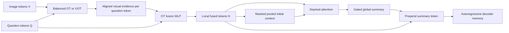

# OT-SAN Implementation Plan

## Status

The OT-SAN engineering path is implemented: masked stacked attention, gated summary
construction, decoder-memory integration, CLI configuration, checkpoint reconstruction,
cached-feature support, diagnostics, CPU tests, and an opt-in MPS smoke test. The
controlled multi-seed experiments and grounding evaluation in milestones M0, M5, and M6
remain pending; no accuracy improvement is claimed before those measurements.

The proposed experiment adds two explicitly named model variants:

- `balanced_ot_san`
- `uot_san`

The name `ot_san` means that a Stacked Attention Network operates **after** OT alignment
and barycentric fusion. It must not be confused with the existing `san` baseline, which
uses SAN directly on image features without an OT plan.

## 1. Motivation and evidence

The current OT path produces one multimodal decoder-memory token for every valid question
token. This preserves local word-to-image alignment, but it has no explicit second-stage
module that repeatedly summarizes the whole aligned sequence. The proposed OT-SAN
adds that global reasoning stage while retaining all local OT-fused tokens.

The most recent 1,000-training-example run stopped at epoch 19:

| Signal | Result | Consequence for this plan |
| --- | ---: | --- |
| Best generated validation F1 | `0.3000` at epoch 11 | Compare against epoch-selected generated F1, not final-epoch loss |
| Training F1 at epoch 11 | `0.3420` | Baseline was still learning at the selected checkpoint |
| Training F1 at epoch 19 | `0.5185` | Later capacity was increasingly spent on memorization |
| Validation F1 at epoch 19 | `0.2800` | More training did not improve generalization |
| Early-stopping patience | `8` epochs | Preserve the same stopping rule in controlled comparisons |

The run does not prove that model capacity is too small. It shows a generalization limit on
a small split. Therefore, the first OT-SAN model must be deliberately small: one attention
stack, a gated residual update, and no removal of the current regularization. A larger SAN
is an ablation, not the default.

## 2. Goal

Build an optional OT-SAN reasoning stage with this data flow:



The design has four requirements:

1. Preserve OT as the only image-question alignment mechanism in the new path.
2. Preserve every valid token-level OT feature for decoder cross-attention.
3. Add a compact global summary that can combine evidence across aligned tokens.
4. Keep existing models, feature caches, diagnostics, and checkpoints working unchanged.

## 3. Non-goals

The first implementation will not:

- replace Sinkhorn or modify the OT objective;
- add a second image encoder or text encoder;
- concatenate the raw image-token sequence with the raw text-token sequence;
- replace the autoregressive decoder with an answer classifier;
- use reference answers during validation or inference;
- claim an improvement from a single random seed;
- increase the default decoder width or depth;
- change early-stopping selection from generated validation F1;
- silently reinterpret old `uot` or `balanced_ot` checkpoints as OT-SAN models.

## 4. Current tensor contracts

Use the following symbols throughout implementation and tests:

| Symbol | Shape | Meaning |
| --- | --- | --- |
| `V` | `[B, N, Dv]` | Spatial image tokens after removal of the ViT CLS token |
| `Q` | `[B, M, Dq]` | Contextual question-token embeddings |
| `V_bar` | `[B, N, Dot]` | Projected visual tokens in the OT space |
| `Q_bar` | `[B, M, Dot]` | Projected question tokens in the OT space |
| `P` | `[B, N, M]` | Balanced or unbalanced transport plan |
| `V_tilde` | `[B, M, Dot]` | Barycentric visual evidence aligned to question tokens |
| `H` | `[B, M, D]` | Current OT-fused decoder-memory tokens |
| `qmask` | `[B, M]` | `True` at padded question positions |
| `s0` | `[B, D]` | Masked pooled initial global context |
| `sL` | `[B, D]` | Context after the final SAN stack |
| `S` | `[B, 1, D]` | Gated global summary token |
| `H_plus` | `[B, M+1, D]` | Summary followed by local OT tokens |
| `mask_plus` | `[B, M+1]` | Summary mask followed by `qmask` |

Here, `B` is batch size, `N` is the number of spatial image tokens, `M` is padded
question length, `Dot` is `OTConfig.ot_dim`, and `D` is `d_model`.

The existing OT feature construction remains:

```text
V_tilde_j = sum_i(P_ij * V_bar_i)
              / max(sum_i(P_ij), minimum_mass)

H_j = FusionMLP([
    Q_bar_j,
    V_tilde_j,
    Q_bar_j * V_tilde_j,
    abs(Q_bar_j - V_tilde_j)
])
```

The concatenation occurs inside each aligned question position. It is not a concatenation
of the full image sequence and full question sequence.

## 5. Recommended OT-SAN design

### 5.1 Initial context

Create the first global context by masked mean pooling over `H`:

```text
valid_j = 1 when qmask_j is False, otherwise 0
s0 = sum_j(valid_j * H_j) / max(sum_j(valid_j), 1)
```

Pseudocode:

```python
valid = (~question_padding_mask).to(fused_tokens.dtype).unsqueeze(-1)
initial_context = (
    (fused_tokens * valid).sum(dim=1)
    / valid.sum(dim=1).clamp_min(1.0)
)
```

The OT utilities already reject an entirely empty valid token set. The OT-SAN module
should still validate this contract and raise a clear error if called independently with
an all-padding sample.

### 5.2 One attention stack

For stack `l`, calculate attention over OT-fused positions using the previous context:

```text
z_j^l = tanh(W_h^l H_j + W_s^l s^(l-1))
e_j^l = w_a^l z_j^l
e_j^l = -infinity when qmask_j is True
alpha^l = softmax(e^l across M)
a^l = sum_j(alpha_j^l * H_j)
s^l = s^(l-1) + dropout(a^l)
```

Each stack returns `[B, D]`. Stacks attend over the unchanged local memory `H`; only the
global query/context is updated. This matches the intent of stacked attention: successive
passes can focus on different OT-aligned evidence while accumulating a global state.

The default architecture uses one stack:

```text
H + s0 -> SAN stack 1 -> s1
```

Two stacks are permitted as an experiment:

```text
H + s0 -> SAN stack 1 -> s1 -> SAN stack 2 -> s2
```

More than two stacks is outside the initial experiment because the available engineering
split already shows overfitting.

### 5.3 Gated residual summary

Do not expose the raw final SAN context directly at initialization. Blend its update with
the stable pooled representation:

```text
g = sigmoid(gate_logit)
summary = s0 + g * (sL - s0)
```

Initialize `gate_logit` to `-2.0`, so `g` starts near `0.119`. The initial model therefore
resembles masked mean pooling and learns how much stacked-attention refinement to use.

The gate should be one scalar in the first implementation. A feature-wise `[D]` gate adds
capacity and is reserved for a later ablation.

Record the sigmoid-transformed gate value in diagnostics. A gate that stays near zero is
evidence that the additional SAN is not useful; it is not a reason to force a larger gate.

### 5.4 Decoder memory construction

Prepend the global summary instead of replacing the local sequence:

```text
H_plus = concat([summary.unsqueeze(1), H], dim=1)
```

Construct the mask as:

```text
summary_mask = all False with shape [B, 1]
mask_plus = concat([summary_mask, qmask], dim=1)
```

The decoder then has access to:

- one global token containing repeated-attention aggregation; and
- `M` local tokens retaining OT-aligned word-level evidence.

Do not broadcast-add the summary to every local token in the first implementation. That
would make it impossible for decoder cross-attention to distinguish the original local
signal from the global signal and could amplify question priors at every position.

### 5.5 Padding behavior

Padding rules are mandatory:

1. Mask attention logits before softmax.
2. Never assign attention probability to padded positions.
3. Keep padded `H` positions equal to zero, as the existing OT module does.
4. Mark the prepended summary token as valid.
5. Pass `mask_plus`, not the original `qmask`, to every decoder cross-attention layer.
6. Reject a mask whose first two dimensions do not match its token tensor.

Use `torch.finfo(scores.dtype).min` for masked logits rather than an untyped literal that
may behave differently under mixed precision.

## 6. Module and API design

### 6.1 New module

Add `model/ot_san.py` with two classes:

```python
@dataclass
class OTSANOutput:
    memory: torch.Tensor
    memory_padding_mask: torch.Tensor
    summary: torch.Tensor
    attention_weights: Optional[torch.Tensor]
    gate: torch.Tensor


class OTSAN(nn.Module):
    def __init__(
        self,
        model_dim: int,
        hidden_dim: int,
        num_layers: int,
        dropout: float,
        gate_init: float = -2.0,
    ): ...

    def forward(
        self,
        fused_tokens: torch.Tensor,
        padding_mask: torch.Tensor,
        return_diagnostics: bool = False,
    ) -> OTSANOutput: ...
```

Keep this module separate from the baseline `StackAttention` initially. The baseline has
checkpoint-sensitive parameter names and no padding-mask interface. A separate module
avoids changing old SAN behavior while making masking and diagnostics explicit.

Internal parameter names should be stable and descriptive:

```text
ot_san.layers.0.ff_image.*
ot_san.layers.0.ff_context.*
ot_san.layers.0.ff_attention.*
ot_san.gate_logit
```

### 6.2 Configuration object

Add a serializable configuration dataclass rather than several loosely related flags:

```python
@dataclass(frozen=True)
class OTSANConfig:
    hidden_dim: int = 128
    num_layers: int = 1
    dropout: float = 0.2
    gate_init: float = -2.0

    def validate(self): ...
    def to_dict(self): ...
    @classmethod
    def from_dict(cls, values): ...
```

Validation rules:

- `hidden_dim >= 1`
- `num_layers in {1, 2}` for the initial implementation
- `0 <= dropout < 1`
- `gate_init` must be finite

Store this dictionary under `model_config["ot_san_config"]` for OT-SAN
variants. Store `None` for existing variants.

### 6.3 Fusion names and helpers

Extend the accepted fusion values to:

```text
san
balanced_ot
uot
balanced_ot_san
uot_san
```

Do not spread string comparisons throughout the code. Define small helpers or normalized
properties on `VQAModel`:

```python
uses_ot = fusion != "san"
uses_ot_san = fusion in {"balanced_ot_san", "uot_san"}
transport_type = "balanced" if fusion.startswith("balanced_ot") else "unbalanced"
```

The exact implementation may use private helper functions, but `model.fusion_type` must
retain the full user-visible value so checkpoints and metrics identify the architecture.

### 6.4 `VQAModel` integration

In `VQAModel.__init__`:

1. Parse and validate the expanded fusion set.
2. Normalize the Balanced OT/UOT transport type.
3. Construct `OptimalTransportFusion` for all four OT variants.
4. Construct `OTSAN` only for the two OT-SAN variants.
5. Persist both configurations in `model_config`.

Do not repurpose `self.san_model` as the OT-SAN module. Existing version-2 and version-3
checkpoints expect its current parameter structure. Use `self.ot_san` for the
new path.

In `encode_from_features`:

```python
transport = self.ot_fusion(...)
memory = transport.fused_tokens
memory_mask = transport.memory_padding_mask

ot_san = None
if self.ot_san is not None:
    ot_san = self.ot_san(
        memory,
        memory_mask,
        return_diagnostics=return_diagnostics,
    )
    memory = ot_san.memory
    memory_mask = ot_san.memory_padding_mask

return EncoderOutput(
    memory=memory,
    memory_padding_mask=memory_mask,
    transport=transport,
    ot_san=ot_san,
)
```

Extend `EncoderOutput` and, when needed, `GenerationOutput` with an optional OT-SAN
diagnostic object. Default it to `None` so lightweight test mocks and old callers remain
valid.

Both online and cached-feature paths already meet in `encode_from_features`; place the new
logic there exactly once. Do not duplicate it in `encode`.

### 6.5 Diagnostics

When `return_diagnostics=False`, do not retain full attention maps beyond the forward pass.
When it is true, return:

| Diagnostic | Shape/value | Purpose |
| --- | --- | --- |
| `attention_weights` | `[B, L, M]` | Inspect focus at each SAN layer |
| `attention_entropy` | scalar per sample/layer | Detect uniform or collapsed attention |
| `summary_norm` | scalar per sample | Detect exploding summaries |
| `gate` | scalar | Measure learned reliance on OT-SAN |

Padded token weights must be exactly zero after softmax. Diagnostic collection must not
alter logits, generation, or checkpoint selection.

## 7. CLI and configuration changes

Update `configs/arg_parser.py`:

```text
--fusion san|balanced_ot|uot|balanced_ot_san|uot_san
--ot_san_hidden_dim 128
--ot_san_layers 1
--ot_san_dropout 0.2
--ot_san_gate_init -2.0
```

Only apply OT-SAN arguments when an OT-SAN fusion is selected. For other fusion choices, either
ignore default values while storing `None` or reject explicitly supplied non-default
values. Prefer rejection of explicit incompatible values if the parser can distinguish
defaults from user input; otherwise document that they are inactive.

Training commands should use a new output directory. Never resume an OT-only checkpoint
as an OT-SAN architecture because the new parameters and optimizer state do not exist.

Example CPU/MPS-sized experiment:

```bash
python train.py \
  --fusion uot_san \
  --ot_profile configs/ot_mps.json \
  --ot_san_layers 1 \
  --ot_san_hidden_dim 128 \
  --ot_san_dropout 0.2 \
  --d_model 384 \
  --ffn_hidden 1024 \
  --num_layers 2 \
  --num_heads 4 \
  --drop_prob 0.2 \
  --freeze_answer_embeddings \
  --weight_decay 0.05 \
  --gradient_clip 1.0 \
  --early_stopping_patience 8 \
  --model_path data/gqa_uot_san
```

Select the OT profile appropriate to the actual device; the example name is not portable
to CUDA or CPU by itself.

## 8. Checkpoints and compatibility

The current checkpoint payload already serializes `model.model_config` and loads model
weights strictly. Keep format version 3 if the payload schema is unchanged. The new
architecture is reconstructed from the new fusion name and
`ot_san_config`.

Compatibility matrix:

| Checkpoint | New code | Expected result |
| --- | --- | --- |
| Version-2 SAN | Load | Existing compatibility path remains unchanged |
| Version-3 `san` | Load | No OT-SAN module is constructed |
| Version-3 `balanced_ot` | Load | No OT-SAN module is constructed |
| Version-3 `uot` | Load | No OT-SAN module is constructed |
| Version-3 `balanced_ot_san` or `uot_san` | Load | Reconstruct OT and OT-SAN modules strictly |
| OT-only resume into OT-SAN run | Reject | Architecture and optimizer states differ |
| OT-SAN resume with identical config | Load | Restore weights, optimizer, scheduler, RNG, epoch, and patience |

Do not use `strict=False` to conceal missing OT-SAN parameters. Architecture mismatch
must fail clearly.

## 9. Feature-cache behavior

No feature-cache format change is required because the cache stores frozen encoder outputs,
not fused memory. The processing remains:

```text
cached image features + cached question-token features
    -> OT
    -> OT fusion
    -> OT-SAN
    -> decoder
```

The current cache prohibition applies only to `fusion == "san"`. New OT-SAN variants
are OT variants and must accept feature caches.

Verify that online and cached paths produce numerically close:

- transport plans;
- OT-fused tokens before post-attention;
- OT-SAN summaries;
- final decoder memory;
- generated token IDs in evaluation mode.

Use the existing half-precision cache tolerance as the starting point; do not require
bitwise equality between cached float16 features and online full-precision features.

## 10. Training and optimization controls

### 10.1 Default capacity

Use these initial values:

| Setting | Initial value | Reason |
| --- | ---: | --- |
| OT-SAN layers | `1` | Minimum additional reasoning capacity |
| SAN hidden dimension | `128` | Reduced after the first run showed memorization without a validation gain |
| SAN dropout | `0.2` | Counter small-data overfitting |
| Gate logit | `-2.0` | Start near the existing pooled representation |
| Early-stopping patience | `8` | Match the baseline run |
| Model-selection metric | generated validation F1 | Match real inference behavior |

Do not tune the baseline and proposed model with different stopping criteria.

### 10.1.1 Anti-overfitting parameter update

The first OT-SAN run reached generated validation F1 `0.3000` at epoch 13 while
teacher-forced training F1 continued from `0.5497` to `0.7972` by epoch 21. Validation
loss increased from `2.4130` to `2.5000` over the same interval. OT convergence remained
`1.0`, so the corrective changes target model capacity and optimization rather than the
Sinkhorn solver.

New training runs use this small-data profile by default:

| Parameter | Previous default | Updated default | Overfitting effect |
| --- | ---: | ---: | --- |
| `d_model` | `768` | `384` | Reduces attention, projection, and output-head capacity |
| `ffn_hidden` | `2048` | `1024` | Reduces decoder feed-forward memorization capacity |
| `num_layers` | `4` | `2` | Halves decoder depth |
| `drop_prob` | `0.1` | `0.2` | Strengthens decoder activation dropout |
| `ot_san_hidden_dim` | `256` | `128` | Reduces the extra fusion-stage capacity |
| `ot_san_layers` | `1` | `1` | Avoids adding another attention stack |
| `ot_san_dropout` | `0.2` | `0.2` | Applies within attention and to the final summary token |
| `freeze_answer_embeddings` | disabled | enabled | Removes a large trainable embedding table |
| `weight_decay` | AdamW implicit `0.01` | `0.05` | Penalizes growth of trainable weights more strongly |
| `gradient_clip` | disabled | `1.0` | Limits unstable or unusually large parameter updates |
| `label_smoothing` | `0.1` | `0.1` | Retains protection against overconfident token targets |
| Early-stopping patience | `8` | `8` | Preserves the late epoch-13 validation recovery |

Do not lower patience below eight based on this run: validation did not improve for seven
epochs before reaching its best score at epoch 13. Early stopping prevents continued
memorization, but it does not replace the capacity and regularization controls above.

The OT-SAN gate is still initialized with logit `-2.0`, giving a sigmoid value near
`0.119`. In the observed run it changed only from `0.1192` to `0.1202`; increasing the
gate or adding a second SAN layer is therefore not justified by current validation data.

These settings apply only to newly constructed models. Resuming a checkpoint reconstructs
its stored model dimensions and restores its stored optimizer state, so an overfit run
must not be converted by resuming it. Train into a new model directory.

### 10.2 Optimizer inclusion

Confirm that all OT-SAN parameters have `requires_grad=True` and appear exactly once in
the optimizer. Log the total and trainable parameter counts for every run. Report the
increment relative to the OT-only baseline.

The first experiment uses the same optimizer, scheduler, learning rate, batch size, label
smoothing, and seed as the baseline. A separate learning rate for the new module is a later
ablation only if the gate remains frozen or gradients are consistently too small.

AdamW uses `weight_decay=0.05` for new regularized runs. Gradients are clipped to a global
norm of `1.0` after backpropagation and before the optimizer step. Passing
`--gradient_clip 0` disables clipping for a controlled ablation. Passing
`--no-freeze_answer_embeddings` restores trainable answer embeddings, but should not be
used on the 1,000-example subset without a measured validation benefit.

### 10.3 Gradient monitoring

For debugging runs, record or print:

- gradient norm of the first SAN image projection;
- gradient norm of the first SAN context projection;
- gradient of `gate_logit`;
- gradient norm of the OT fusion MLP;
- gradient norm of the decoder cross-attention.

The new path fails its integration check if answer loss cannot backpropagate to both the
OT-SAN and the OT fusion module.

### 10.4 Early stopping interpretation

The baseline stopped at epoch 19 because epochs 12 through 19 did not exceed the best
generated validation F1 of `0.3000` from epoch 11. The proposed path should preserve the
same behavior:

```text
improved = higher generated F1
        or equal generated F1 with lower validation loss
```

Do not treat reaching epoch 19 as a fixed model limit. It was the consequence of eight
consecutive non-improving validation epochs.

## 11. Test plan

### 11.1 Unit tests for OT-SAN

Add focused tests, preferably in `tests/test_ot_san.py`:

1. **Shape preservation and extension**
   - Input `[B, M, D]` produces memory `[B, M+1, D]`.
   - Output mask is `[B, M+1]`.

2. **Padding isolation**
   - Padded positions have exactly zero attention weight.
   - Changing values only at padded positions does not change the summary.

3. **All-valid input**
   - No mask produces finite output and normalized attention weights.

4. **Invalid shapes**
   - Rank errors and mismatched masks raise descriptive `ValueError`s.

5. **Empty valid sequence**
   - An all-padding sample raises a descriptive error before softmax.

6. **Gate initialization**
   - Returned gate is close to `sigmoid(-2.0)`.
   - With a very negative gate, summary is close to masked mean pooling.

7. **Gradient flow**
   - A scalar loss on output memory gives finite gradients to every SAN layer and gate.

8. **Diagnostics neutrality**
   - Enabling diagnostics does not change memory values in evaluation mode.

### 11.2 Model integration tests

Extend `tests/test_logic.py` and `tests/test_optimal_transport.py`:

- Construct both new fusion variants.
- Assert that Balanced OT selects balanced transport and UOT selects unbalanced transport.
- Confirm online and cached paths remain close.
- Confirm decoder memory and memory mask lengths both increase by one.
- Run teacher-forced forward and autoregressive generation without a reference answer.
- Backpropagate answer loss and check finite gradients in OT, OT-SAN, and decoder modules.
- Save and strictly reload an OT-SAN checkpoint.
- Resume a short training run and verify epoch/global-step/patience restoration.
- Confirm `return_diagnostics=True` returns both OT and OT-SAN diagnostics.
- Confirm existing SAN and OT-only checkpoint tests still pass without updated fixtures.

### 11.3 Numerical/device tests

Run the CPU suite first. Extend the opt-in MPS smoke test to exercise one OT-SAN forward,
backward, and optimizer step. If CUDA is available, verify mixed-precision training while
retaining the current rule that Sinkhorn calculations run in float32.

Acceptance conditions:

- no NaN or infinity in plans, summaries, attention weights, logits, losses, or gradients;
- attention weights sum to one over valid tokens within tolerance;
- padded weights equal zero;
- cached and online paths remain within documented tolerance;
- no regression in the existing test suite.

## 12. Experiment plan

### 12.1 Required comparisons

Run the following with identical data splits, preprocessing, decoder size, OT profile,
optimizer, scheduler, stopping rule, and seeds:

| ID | Fusion | Post layers | Purpose |
| --- | --- | ---: | --- |
| E0 | `uot` | `0` | Primary OT-only baseline |
| E1 | `uot_san` | `1` | Proposed minimal model |
| E2 | `uot_san` | `2` | Capacity ablation, only after E1 |
| E3 | `balanced_ot` | `0` | Balanced reference |
| E4 | `balanced_ot_san` | `1` | Determine whether gain depends on UOT |

E0 versus E1 is the primary decision. Do not proceed to larger variants merely because E1
reduces training loss faster.

### 12.2 Multiple seeds

The validation split has only 100 examples, so a difference of `0.01` may represent one
example. Run at least three fixed seeds and report:

```text
mean generated F1
standard deviation
individual seed results
best epoch per seed
train-validation gap at the selected epoch
```

Do not claim an improvement from one run whose advantage is one or two validation examples.

### 12.3 Grounding diagnostics

For every selected checkpoint, measure:

1. Normal validation performance.
2. Performance with images shuffled within the batch or dataset.
3. Performance with questions shuffled while images stay fixed.
4. Prediction-change rate under image shuffle.
5. Prediction-change rate under question shuffle.

Desired behavior is not merely a lower image-shuffle score. The model should show a
consistent, interpretable dependence on correct image evidence while retaining question
dependence.

Also inspect:

- OT convergence rate and residual;
- matched, unmatched, and excess mass;
- transport-plan entropy;
- OT-SAN attention entropy per layer;
- learned gate value;
- unique generated answers and top-answer fraction.

### 12.4 Qualitative review

For a fixed set of examples, save:

- image and question;
- reference answer;
- OT-only prediction;
- OT-SAN prediction;
- OT transport visualization;
- OT-SAN attention weights over question tokens;
- gate value.

Look for cases where the SAN summary integrates two or more aligned concepts, such as
object plus attribute or subject plus relation. Also record regressions where SAN focuses
on common question words or strengthens frequent-answer bias.

## 13. Risks and mitigations

| Risk | Detection | Mitigation |
| --- | --- | --- |
| Additional overfitting | Training F1 rises while generated validation F1 stalls | One layer, small hidden size, dropout, gating, early stopping |
| Question-prior amplification | Image shuffle barely changes predictions | Preserve local OT tokens, inspect grounding metrics, avoid broadcasting summary |
| Padding leakage | Padded-token perturbation changes output | Mask logits before softmax and add invariance test |
| Loss of local alignment | Decoder uses only summary token | Inspect decoder cross-attention; retain all local tokens |
| Attention collapse | Very low entropy on irrelevant token or uniform weights | Log attention entropy and review examples |
| Gate collapse to zero | Gate stays near initialization | Treat as evidence against added module before tuning |
| Gate saturates near one early | Large gate gradient/update | Lower module learning rate only as a controlled ablation |
| Checkpoint incompatibility | Strict-load failure | Persist full config; never silently load with `strict=False` |
| Cached/online divergence | Different predictions for same inputs | Keep integration after shared `encode_from_features`; test tolerance |
| Confusing experiment names | Results labeled only `uot` | Store full fusion name in checkpoint and metrics |

## 14. Implementation milestones

### M0 — Lock the baseline

- Preserve the OT-only configuration and data split used for comparison.
- Record seed, command, checkpoint, best epoch, generated F1, and OT diagnostics.
- Confirm that `best.pt`, not `last.pt`, is used for evaluation.

**Exit condition:** the baseline is reproducible and its complete configuration is saved.

### M1 — Implement the isolated OT-SAN module

- Add `OTSANConfig`.
- Add masked stacked attention, pooled context, gate, summary prepend, and diagnostics.
- Add unit tests for shapes, masks, invariance, gate behavior, and gradients.

**Exit condition:** focused unit tests pass on CPU without touching `VQAModel`.

### M2 — Integrate with OT encoding

- Add new fusion names and normalized fusion helpers.
- Construct the OT-SAN module only for new variants.
- Apply it once in `encode_from_features`.
- Extend encoder/generation outputs with optional diagnostics.
- Verify both online and cache-backed paths.

**Exit condition:** forward, backward, and generation work for both new variants.

### M3 — Complete persistence and CLI support

- Add CLI arguments and validation.
- Serialize OT-SAN configuration in `model_config`.
- Strictly save/load and resume an OT-SAN checkpoint.
- Preserve all old checkpoint tests.

**Exit condition:** a stopped run can resume exactly with the same architecture and state.

### M4 — Run smoke tests

- Overfit one tiny batch to prove learnability.
- Run a short cached-feature training job.
- Confirm finite gradients and stable diagnostics on the target device.
- Confirm early stopping and `best.pt` selection still work.

**Exit condition:** the new path completes training and generation without numerical errors.

### M5 — Run controlled experiments

- Run E0 and E1 for at least three seeds.
- Run image/question shuffle diagnostics.
- Compare parameter count, runtime, best epoch, and generated metrics.
- Run E2/E4 only if the primary result justifies more experiments.

**Exit condition:** evidence supports keeping or rejecting OT-SAN.

### M6 — Documentation and final decision

- Update the README architecture and example commands.
- Update the visual architecture guide if the variant is retained.
- Record results, limitations, and the selected default.
- Keep `uot` as the default OT experiment unless evidence supports changing it.

**Exit condition:** code, tests, commands, diagrams, and claims agree.

## 15. Acceptance criteria

### Engineering acceptance

The feature is implementation-complete when:

1. Existing `san`, `balanced_ot`, and `uot` behavior remains unchanged.
2. Both new variants train and generate through online and cached paths.
3. Decoder memory is `[B, M+1, D]` and its mask is `[B, M+1]`.
4. Padding cannot influence the SAN summary.
5. Answer loss reaches OT, OT-SAN, and decoder parameters.
6. Checkpoints strictly load and resumable state is restored.
7. CPU tests and the selected-device smoke test pass.
8. Diagnostics add no change to non-diagnostic predictions.

### Research acceptance

The new architecture should be retained as a useful model option only if the multi-seed
comparison shows at least one of the following without a material regression in the other:

- a credible improvement in generated validation/test F1; or
- stronger causal dependence on correct image evidence.

A lower training loss, higher teacher-forced training F1, later early-stopping epoch, or
larger learned gate is not sufficient evidence by itself.

## 16. Recommended first implementation

The minimum defensible version is:

```text
UOT alignment
    -> existing barycentric token fusion H
    -> masked mean context s0
    -> one masked SAN stack s1
    -> summary = s0 + sigmoid(-2 at initialization) * (s1 - s0)
    -> prepend summary to H
    -> decoder cross-attention with the extended mask
```

This design preserves the current model's strongest property—token-level OT alignment—
while testing the new hypothesis with the smallest reasonable increase in capacity.
